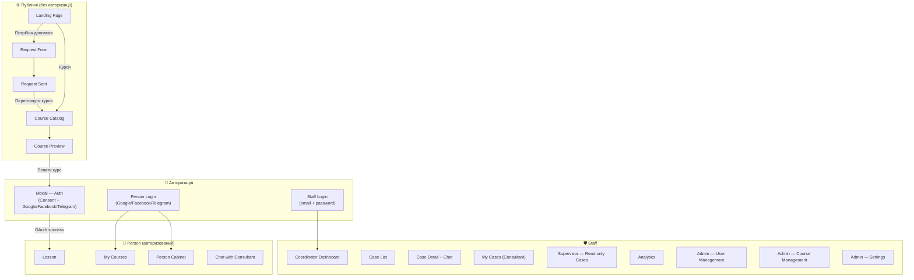

# Карта сайту (Site Map) — "Є турбота"

## 1. Загальна структура

## 2. Екрани та доступ

### Публічна зона (Guest — без авторизації)

| Екран | URL | Контент | Дії користувача |
|---|---|---|---|
| **Landing Page** | `/` | Навбар (логотип, Курси, Увійти), hero-секція з описом служби, дві CTA ("Потрібна допомога", "Переглянути курси"), блок переваг | Перехід до форми звернення або каталогу курсів |
| **Course Catalog** | `/courses` | Сітка карток курсів (назва, опис, кількість уроків, тривалість), банер "Потрібна допомога?" | Вибір курсу → превью |
| **Course Preview** | `/courses/:id` | Сайдбар зі списком уроків (заблоковані), відео-трейлер або анонс, опис курсу, CTA "Почати курс" | Натискає "Почати курс" → модалка авторизації |
| **Request Form** | `/request` | Поля: ім'я, країна, мова, спосіб зв'язку (email/Telegram/Facebook), тема (список), опис (textarea), два GDPR чекбокси | Заповнює форму → підтвердження |
| **Request Sent** | `/request/success` | Іконка успіху, 3-крокова шкала прогресу, кнопка "Переглянути курси", посилання на Telegram-бот | Переходить до курсів або чекає |

### Модалки авторизації

| Екран | Контекст | Контент | Дії |
|---|---|---|---|
| **Modal — Auth (Course Start)** | Поверх Course Preview | Заголовок "Створення акаунту", опис, чекбокс згоди на обробку даних, три кнопки: Google / Facebook / Telegram, "Скасувати" | Обирає провайдер → OAuth → перший урок курсу |
| **Person Login** | `/login` | Ілюстрація + три кнопки (Google / Facebook / Telegram), посилання на політику | Прямий вхід (з навбару або глибокого посилання) |
| **Staff Login** | `/staff/login` | Поля email + пароль | Вхід для staff ролей |

### Person (авторизований, роль: Person)

| Екран | URL | Контент | Що бачить |
|---|---|---|---|
| **My Courses** | `/my/courses` | Сайдбар з навігацією, активні курси з прогресом, рекомендовані курси | Тільки свої enrollment-и та рекомендації |
| **Lesson** | `/courses/:id/lessons/:lessonId` | Сайдбар з уроками (completed/active/locked), відео/текст уроку, кнопка "Поговорити з консультантом" | Контент уроку, свій прогрес |
| **Person Cabinet** | `/my` | Призначений консультант, наступна зустріч, рекомендовані курси, кнопка "Написати" | Тільки свої дані, свого консультанта |
| **Chat** | `/my/chat` | Переписка з консультантом, обмін файлами/зображеннями | Тільки свою переписку. НЕ бачить нотатки консультанта |

### Consultant (авторизований, роль: Consultant)

| Екран | URL | Контент | Що бачить |
|---|---|---|---|
| **My Cases** | `/staff/cases` | Список кейсів зі статусами (кризові зверху), ім'я людини, тема, терміновість, час останнього повідомлення | Тільки СВОЇ кейси |
| **Case Detail** | `/staff/cases/:id` | Чат з людиною, приватні нотатки, коментарі супервізора, прогрес курсу, кнопка "Запланувати зустріч" | Переписку своїх кейсів, нотатки (свої + коментарі супервізора) |
| **Schedule Meeting** | `/staff/cases/:id/meeting` | Вибір дати, часу, тривалості, генерація Zoom/Meet посилання | Планує зустрічі тільки для своїх кейсів |
| **My Profile** | `/staff/profile` | Спеціалізації, мови, робочі години, ліміт кейсів, кнопка "Я йду у відпустку" | Свій профіль, статус |

### Supervisor (авторизований, роль: Supervisor)

| Екран | URL | Контент | Що бачить |
|---|---|---|---|
| **All Cases** | `/staff/supervisor/cases` | Всі кейси ВСІХ консультантів, фільтр по консультанту/темі/статусу/терміновості | READ-ONLY доступ до всіх кейсів. НЕ може писати людині |
| **Case Detail (RO)** | `/staff/supervisor/cases/:id` | Переписка (read-only), нотатки консультанта (read-only), форма приватного коментаря | Бачить все, може залишити коментар консультанту |
| **Quality Report** | `/staff/supervisor/reports` | Середній час відповіді по консультантах, кейси без активності > 7 днів, відгуки | Агреговані метрики по всіх консультантах |
| **Crisis Alerts** | (real-time notifications) | Push + email при спрацюванні кризового протоколу | Миттєві сповіщення |
| **Crisis History** | `/staff/supervisor/crisis` | Історія кризових alerts з фільтрами (дата, статус, консультант), tracking resolution | Всі кризові events, не тільки real-time push |

### Coordinator (авторизований, роль: Coordinator)

| Екран | URL | Контент | Що бачить |
|---|---|---|---|
| **Dashboard** | `/staff/dashboard` | Статистика: нові звернення, необроблені, SLA-порушення, кризові. Навантаження консультантів (поточне/ліміт) | Повний огляд стану системи |
| **Case Assignment** | `/staff/dashboard/assign` | Нові кейси, пропозиції автоматичного розподілу, кнопка override | Може вручну перепризначити кейс |
| **Analytics** | `/staff/analytics` | Графіки: динаміка звернень за темами, розподіл навантаження, bottleneck-аналіз | Тренди та статистика |
| **Case Detail (RO)** | `/staff/dashboard/cases/:id` | Деталі кейсу (read-only), контекст для informed assignment/reassignment | Переписка, нотатки, статус — без можливості редагування |

### Admin (авторизований, роль: Admin)

| Екран | URL | Контент | Що бачить |
|---|---|---|---|
| **User Management** | `/staff/admin/users` | CRUD користувачів, призначення ролей, деактивація | Всі користувачі системи |
| **Course Management** | `/staff/admin/courses` | CRUD курсів та уроків, статуси (чернетка/опублікований/архівний) | Всі курси, включаючи чернетки |
| **Settings** | `/staff/admin/settings` | SLA-пороги, ліміти навантаження, кризові ключові слова, параметри автоматизації | Системні налаштування |
| **Audit Log** | `/staff/admin/audit` | Хто, коли, що змінив — для всіх дій з персональними даними | Повний журнал дій |

## 3. Матриця доступу

| Екран / Функція | Guest | Person | Consultant | Supervisor | Coordinator | Admin |
|---|---|---|---|---|---|---|
| Landing, Catalog, Preview | ✅ | ✅ | ✅ (read) | ✅ (read) | ✅ (read) | ✅ (read) |
| Request Form | ✅ | ✅ | — | — | — | — |
| My Courses / Lessons | — | ✅ | — | — | — | — |
| Person Cabinet / Chat | — | ✅ | — | — | — | — |
| My Cases (свої) | — | — | ✅ | — | — | — |
| Case Detail (свої) | — | — | ✅ | — | — | — |
| All Cases (read-only) | — | — | — | ✅ | — | — |
| Comment to Consultant | — | — | — | ✅ | — | — |
| Quality Report | — | — | — | ✅ | — | ✅ |
| Dashboard | — | — | — | — | ✅ | ✅ |
| Case Assignment (override) | — | — | — | — | ✅ | ✅ |
| Analytics | — | — | — | — | ✅ | ✅ |
| User Management | — | — | — | — | — | ✅ |
| Course Management | — | — | — | — | — | ✅ |
| Settings / Audit Log | — | — | — | — | — | ✅ |
| Case Detail (read-only) | — | — | — | — | ✅ (read) | ✅ |
| Crisis Alerts | — | — | ✅* | ✅ | ✅ | ✅ |
| Crisis History Page | — | — | — | ✅ | ✅ | ✅ |

*Consultant отримує кризове сповіщення тільки для своїх кейсів

**Multi-role:** Якщо user має кілька ролей (напр. Consultant + Coordinator), доступ визначається OR-логікою — користувач отримує об'єднання permissions усіх своїх ролей

## 4. Навігація

**Person навбар:** Логотип · Курси · Допомога · [Ім'я / Увійти]

**Staff сайдбар (Consultant):** Мої кейси · Профіль · Вийти *(Dashboard прибрано — немає Consultant-specific overview)*

**Staff сайдбар (Supervisor):** Всі кейси · Звіти · Кризові alerts · Вийти *(Dashboard прибрано — redirect до Всі кейси)*

**Staff сайдбар (Coordinator):** Dashboard · Призначення · Аналітика · Вийти

**Staff сайдбар (Admin):** Dashboard · Користувачі · Курси · Налаштування · Аудит · Вийти
